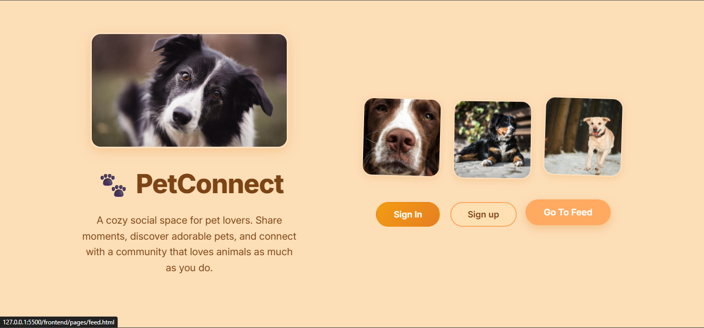
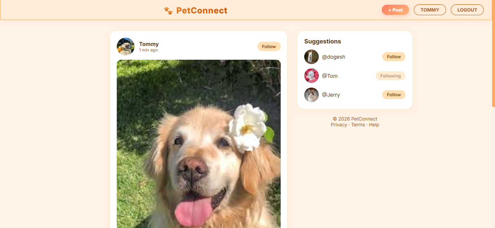
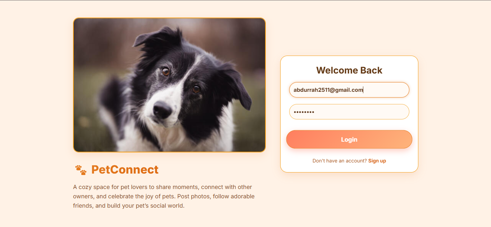
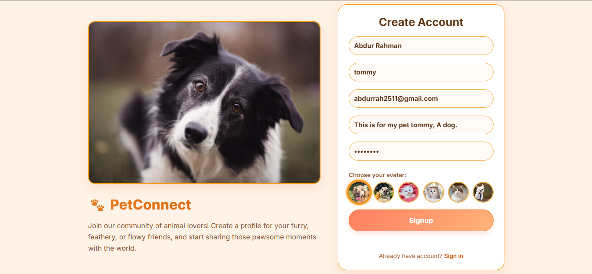
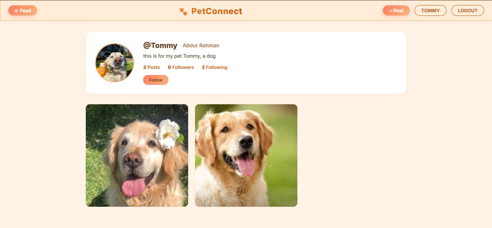
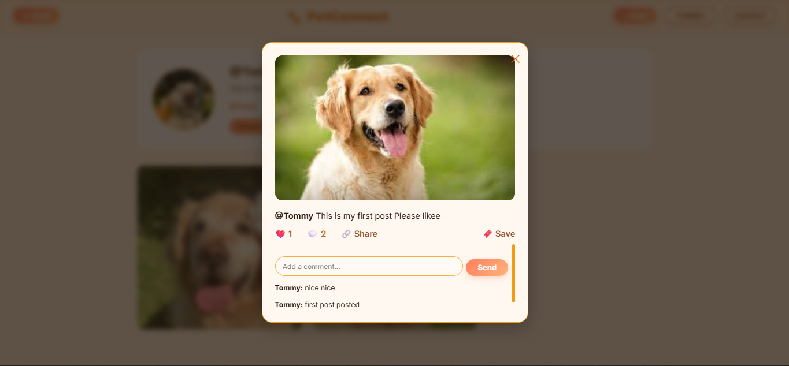
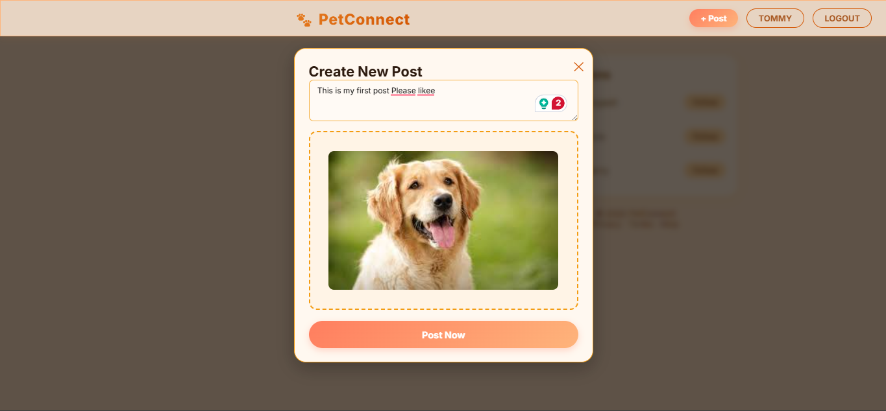

# 🐾 PetConnect – Social Media for Pets Lovers

A full-stack social media platform where users can share posts of their pets, interact with others, and build a pet-loving community.

---

#### ✨ Features

### 👤 Authentication
- User Signup & Login
- JWT-based authentication
- Protected API routes


### 🐶 User Profiles
- Profile with name + username (@handle) + Bio
- Default avatar selection
- Followers & Following system
- View user posts


### 📸 Posts
- Upload pet images
- Add captions
- View global feed
- Infinite scroll feed


###  Social Interactions
- Like / Unlike posts
- Comment on posts
- Follow / Unfollow users


### 🧭 Feed System
- Infinite scrolling feed
- Real-time updates on like/comment
- Clean card-based UI


### 👥 Sidebar (Suggestions)
- Suggested users list
- Follow directly from feed
- Profile navigation

### 💬 Comments UI
- Add comments
- View comments dynamically
- (Expandable UI ready for slider panel upgrade)

### 🎨 UI Features
- Modern card layout
- Clean centered feed
- Responsive structure
- Profile navigation

---

## 🛠️ Tech Stack

### Frontend
- HTML
- CSS
- JavaScript (Vanilla)

###  Backend
- Node.js
- Express.js

### Database
- MongoDB

###  Other Tools
- JWT (Authentication)
- Multer (Image Uploads)

### Deployment
- Frontend: Netlify / Vercel
- Backend: Render

---

## 📂 Project Structure

```bash
pet-connect/
│
├── backend/
│   ├── config/
│   ├── controllers/
│   ├── middleware/
│   ├── models/
│   ├── routes/
│   ├── uploads/
│   └── server.js
│
├── frontend/
│   ├── js/
│   ├── css/
│   ├── pages/
│   └── index.html
│
└── README.md

```

---

## ⚙️ Environment Variables

Create a `.env` file inside backend:

MONGO_URI=mongodb://127.0.0.1:27017/pet-social
JWT_SECRET=meowmeow_supersecretkey
PORT=5000

---

#### 🧪 How to Run Locally

### 🔧 Backend

cd backend
npm install
npm run dev

### 🌐 Frontend

Open `index.html` in browser
(or use Live Server)

---

## 📸 Screenshots

### 🏠 Home Page


### 🃏 Feed Page


### 🃏 Authentication SignIn Page


### 🃏 Authentication SignUp Page


### 🛒 Profile Page


### 📦 Post Page


### 📦 Posting Page


---

## 🔮 Future Improvements

- Cloudinary image upload
- Real-time notifications
- Comment slider panel UI
- Dark mode
- Mobile responsive design
- Search users
- Explore page

---

## 🧠 What I Learned
- Full-stack development (MERN fundamentals)
- REST API design
- JWT authentication
- File uploads with Multer
- Infinite scroll implementation
- Frontend-backend integration

---

### 📬 Contact

if you like this project or want to collaborate:

- GitHub: https://github.com/abdurrah2511

---

## ⭐ Give a Star

If you found this project useful, consider giving it a ⭐
